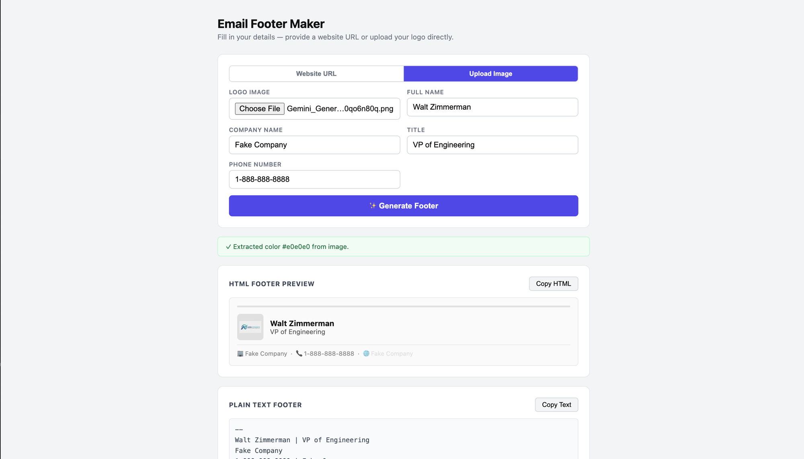

# email-footer-maker



A local web tool that generates branded email footers. Give it a company URL and your contact details — it scrapes the site for brand colors, logo, and company name, then outputs a styled HTML footer and a plain text version, both ready to copy-paste.

## Features

- Scrapes primary brand color, logo, and company name from any website
- Outputs a styled **HTML footer** with logo, name/title, and contact info
- Outputs a **plain text footer** as a fallback
- One-click copy buttons for both formats
- Graceful fallbacks when scraping partially fails

## Usage

```bash
npm install
npm start
```

Then open [http://localhost:3000](http://localhost:3000) in your browser.

### Fields

| Field | Description |
|---|---|
| Company Website URL | Used to scrape brand info; also linked in the footer |
| Full Name | Your display name |
| Title | Your job title |
| Phone Number | Your contact phone |

## What Gets Scraped

| Brand Element | Sources (in priority order) |
|---|---|
| Primary color | `theme-color` meta → CSS custom property (`--primary`, `--brand`, etc.) → `#1a1a1a` |
| Logo | `og:image` → `apple-touch-icon` → favicon (SVG/PNG preferred) → none |
| Font family | Google Fonts link → body `font-family` → `system-ui, sans-serif` |
| Company name | `og:site_name` → `<title>` (stripped of taglines) → domain name |

## Output Example

**HTML footer:**

```html
<div style="border-top: 3px solid #0066cc; padding-top: 12px; font-family: Inter, sans-serif;">
  <div style="display:flex; align-items:center; gap:12px; margin-bottom:8px;">
    
    <div>
      <div style="font-weight:700; font-size:14px; color:#111;">Jane Smith</div>
      <div style="font-size:12px; color:#555;">Senior Engineer</div>
    </div>
  </div>
  <div style="border-top:1px solid #e5e7eb; padding-top:8px; font-size:11px; color:#888;">
    🏢 Acme &nbsp;·&nbsp; 📞 555-867-5309 &nbsp;·&nbsp;
    <a href="https://acme.com" style="color:#0066cc;">🌐 acme.com</a>
  </div>
</div>
```

**Plain text footer:**

```
--
Jane Smith | Senior Engineer
Acme
555-867-5309 | acme.com
```

## Stack

- **Backend:** Node.js + Express
- **Scraping:** Cheerio
- **Frontend:** Vanilla HTML/CSS/JS — no build step

## Project Structure

```
email-footer-maker/
├── server.js      # Express server + /scrape route
├── scraper.js     # Brand scraping logic
├── index.html     # SPA frontend
└── package.json
```
